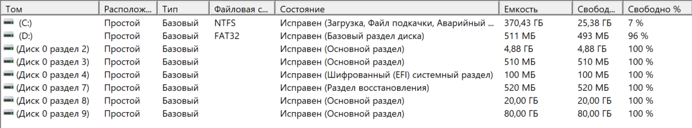
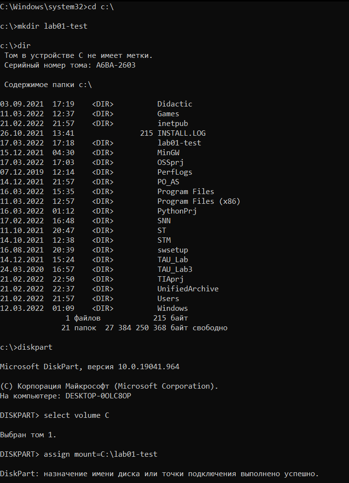

---

title: Отчет по ЛР №1 "Основы C++ и Windows API"

выполнил:

 студент: Баснак Е.А.
 группа: А-03-19

проверил:

 Козлюк Д.А.

---

# Цель работы

1. Владеть C++ на минимально необходимом уровне для выполнения ЛР.
2. Уметь нахоидть и читать официальную документацию Windows API.
3. Уметь применять отдельные функции и группы связанных функций Windows API для решения задач, связанных с назначением этих функций.

# Выполнение работы

## Точные замеры времени. Указатели и структуры.

```cpp
    printf("Точные замеры времени\n\n");
    LARGE_INTEGER t0, t1, frequency;
    if (QueryPerformanceCounter(&t0))
    {
        double result = sqrt(t0.QuadPart);
        if (QueryPerformanceCounter(&t1))
        {
            if (QueryPerformanceFrequency(&frequency))
            {
                double ticks = t1.QuadPart - t0.QuadPart;
                double ticks_per_sec = frequency.QuadPart;
                double usec_per_sec = 1e6;
                double usec = usec_per_sec * ticks / ticks_per_sec;
                printf("result = %g, duration = %.1f usec\n", result, usec);
            }
            else
            {
                printf("Ошибка (Freq): %u\n", GetLastError());
            }
        }
        else
        {
            printf("Ошибка (Counter t1): %u\n", GetLastError());
        }
    }
    else
    {
        printf("Ошибка (Counter t0): %u\n", GetLastError());
    }

```
---
### Результат работы

Точные замеры времени

result = 1.31951e+006, duration = 6.5 usec

---

## Получение версии Windows. Битовые операции.

```cpp
    printf("\nПолучение версии Windows\n\n");

    DWORD info = GetVersion();
    DWORD mask = 0x0000'ffff;
    DWORD version = info & mask;
    DWORD platform = info >> 16;

    DWORD major_mask = 0x00'ff;
    DWORD version_major = version & major_mask;
    DWORD version_minor = version >> 8;

    if ((info & 0x8000'0000) == 0) {
        DWORD build = platform >> 8;
        printf("Windows v%d.%d (build %d)\n", version_major, version_minor, build);
    }
```

---

### Результат работы

Получение версии Windows

Windows v6.2 (build 35)

(версия 6.2 не соответствует действительной версии моей ОС, но в документации написано, что функция возвращает такое значение для всех версий Windows, начиная с Windows 8)

---

## Получение текстовых данных. Кодировки и строки C.

```cpp
    printf("\nПолучение текстовых данных\n\n");

    char system_dir[MAX_PATH];
    if (GetSystemDirectoryA(system_dir, MAX_PATH))
        printf("System directory: %s\n", system_dir);
    else
        printf("Ошибка SysDir: %u\n", GetLastError());

    char UserName[UNLEN+1];
    DWORD UserNameLen = UNLEN + 1;
    if (GetUserNameA(UserName, &UserNameLen))
        printf("Username: %s\n", UserName);
    else
        printf("Ошибка UserName: %u\n", GetLastError());

    char CompName[MAX_COMPUTERNAME_LENGTH+1];
    DWORD CompNameLen = MAX_COMPUTERNAME_LENGTH + 1;
    if (GetComputerNameA(CompName, &CompNameLen))
        printf("Computer name: %s\n", CompName);
    else
        printf("Ошибка CompName: %u\n", GetLastError());
```

---

### Результат работы

Получение текстовых данных

System directory: C:\Windows\system32

Username: exxtie

Computer name: DESKTOP-0OLC8OP


    


---

## Получение информации о дисках. Получение пути к тому в файловой системе. Получение информации о свободном месте на томе.

```cpp
    printf("\nПолучение информации о дисках + Получение пути к тому в файловой системе + Получение информации о свободном месте на томе\n\n");

    char buffer[MAX_PATH];

    HANDLE search = FindFirstVolumeA(buffer, sizeof(buffer));
    do {
        printf("Volume: %s\n", buffer);

        char path_buffer[MAX_PATH * 4];
        PDWORD retlen = 0;
        GetVolumePathNamesForVolumeNameA(buffer, path_buffer, MAX_PATH*4, retlen);
        char* path = path_buffer;
        int i = 1;
        while (path[0])
        {
            printf("Mount point %d: %s\n", i, path);
            path += strlen(path) + 1;
            i++;
        }

        // Получение информации о свободном месте на томе (начало)
        printf("\nИнформация о свободном месте на томе\n\n");

        ULARGE_INTEGER FreeBytes, TotalBytes, TotalFreeBytes;
        if (GetDiskFreeSpaceExA(buffer, &FreeBytes, &TotalBytes, &TotalFreeBytes))
        {
            printf("Total number of MB on a disk: %u MB\n", TotalBytes.QuadPart / (1024*1024));
            printf("Total number of free MB: %u MB\n", TotalFreeBytes.QuadPart / (1024*1024));
            printf("Total number of free MB available to the caller: %u MB\n", FreeBytes.QuadPart / (1024*1024));
        }
        else
        {
            printf("GetDiskFreeSpaceExA Error: %u\n", GetLastError());
        }
        // Получение информации о свободном месте на томе (конец)

        printf("\n");
    } while (FindNextVolumeA(search, buffer, sizeof(buffer)));

    if (GetLastError() != ERROR_NO_MORE_FILES) {
        printf("Произошла ошибка %u\n", GetLastError());
    }

    FindVolumeClose(search);
```

---

### Результат работы

Получение информации о дисках + Получение пути к тому в файловой системе + Получение информации о свободном месте на томе

Volume: \\?\Volume{61d97585-3738-4b8b-bb99-511c96f0089b}\

Mount point 1: D:\

Информация о свободном месте на томе

Total number of MB on a disk: 510 MB

Total number of free MB: 493 MB

Total number of free MB available to the caller: 493 MB

<br/>

Volume: \\?\Volume{061c9bff-c99b-465a-a4cc-fe2bbf72dd7d}\

Mount point 1: C:\

Mount point 2: C:\lab01-test\

Информация о свободном месте на томе

Total number of MB on a disk: 379324 MB

Total number of free MB: 25778 MB

Total number of free MB available to the caller: 25778 MB

<br/>

Volume: \\?\Volume{b2f1aa00-de52-4e73-9541-86d82be60802}\

Информация о свободном месте на томе

Total number of MB on a disk: 519 MB

Total number of free MB: 84 MB

Total number of free MB available to the caller: 84 MB  

<br/>

Volume: \\?\Volume{5efd94c1-8a22-4e89-8289-2b230dacaa5c}\

Информация о свободном месте на томе

Total number of MB on a disk: 96 MB

Total number of free MB: 70 MB

Total number of free MB available to the caller: 70 MB



---

В данном пункте для проверки работы вывода точек монтирования для диска C была добавлена дополнительная точка монитрования C:\lab01-test.


